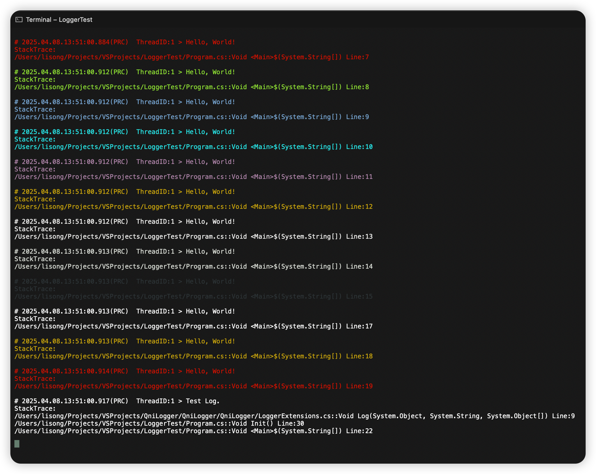

# QniLogger
unity and server console simple log tool.

## How To Use

### Console
```cs
// init logger
Qni.QniLogger.Init(Qni.ELogChannel.Console);


Qni.QniLogger.LogColor(Qni.ELogColor.Red, "Hello, World!");
Qni.QniLogger.LogColor(Qni.ELogColor.Green, "Hello, World!");
Qni.QniLogger.LogColor(Qni.ELogColor.Blue, "Hello, World!");
Qni.QniLogger.LogColor(Qni.ELogColor.Cyan, "Hello, World!");
Qni.QniLogger.LogColor(Qni.ELogColor.Magenta, "Hello, World!");
Qni.QniLogger.LogColor(Qni.ELogColor.Yellow, "Hello, World!");
Qni.QniLogger.LogColor(Qni.ELogColor.White, "Hello, World!");
Qni.QniLogger.LogColor(Qni.ELogColor.Gray, "Hello, World!");
Qni.QniLogger.LogColor(Qni.ELogColor.Black, "Hello, World!");

Qni.QniLogger.Log("Hello, World!");
Qni.QniLogger.LogWarning("Hello, World!");
Qni.QniLogger.LogError("Hello, World!");

var _test = new LogTest();
_test.Init();

Console.ReadKey();


public class LogTest {
    public void Init () {
        this.Log("Test Log.");
    }
}
```

terminal:


